<h2>TensorFlow-FlexUNet-Image-Segmentation-Breast-Lesions-USG (2025/09/03)</h2>

This is the first experiment of Image Segmentation for Breast-Lesions-USG (Benign and Malignant)
 based on our 
TensorFlowFlexUNet (TensorFlow Flexible UNet Image Segmentation Model for Multiclass) 
and a 512x512 pixels 
<a href="https://drive.google.com/file/d/1Lz_95ooDFiIkXHSO7s3CdeSnt8y7LgGI/view?usp=sharing">
Augmented-Breast-Lesions-USG-ImageMask-Dataset.zip</a> with colorized masks (benign:green, malignant:red), 
which was derived by us from 
  
<a href="https://www.cancerimagingarchive.net/collection/breast-lesions-usg/">
<b>
Breast-Lesions-USG | A Curated Benchmark Dataset for Ultrasound Based Breast Lesion Analysis
</b>
</a>
 

 
<b>Acutual Image Segmentation for 512x512 Breast-Lesions-USG images</b> 

As shown below, the inferred masks predicted by our segmentation model trained on the 
PNG dataset appear similar to the ground truth masks. 
<b>rgb_map =  (benign:green, malignant:red)</b> 
 
 
<table>
<tr>
<th>Input: image</th>
<th>Mask (ground_truth)</th>
<th>Prediction: inferred_mask</th>
</tr>
<tr>
<td>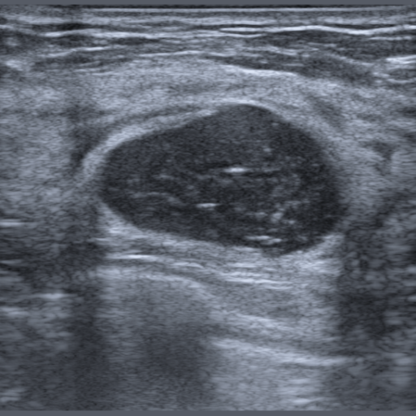</td>
<td>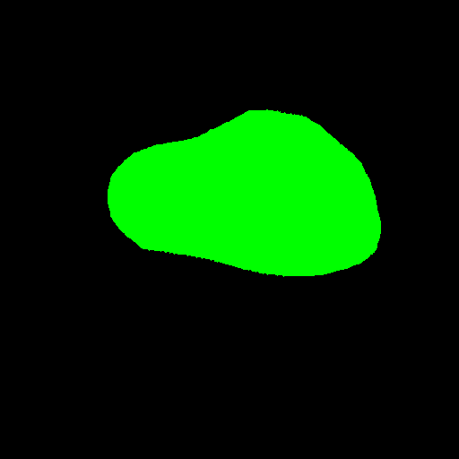</td>
<td>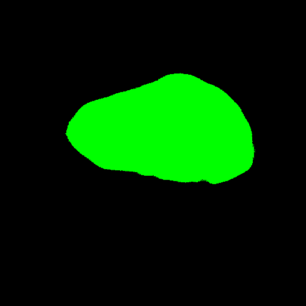</td>
</tr>
<tr>
<td>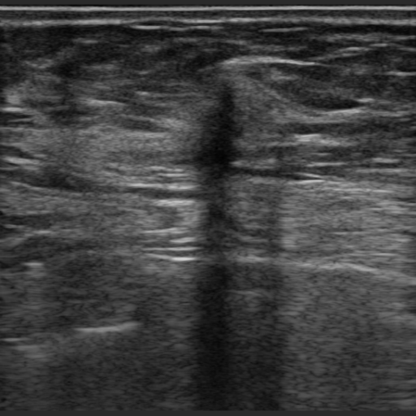</td>
<td></td>
<td></td>
</tr>
<tr>
<td>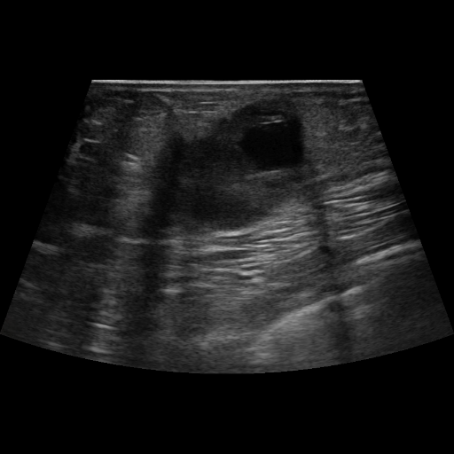</td>
<td></td>
<td>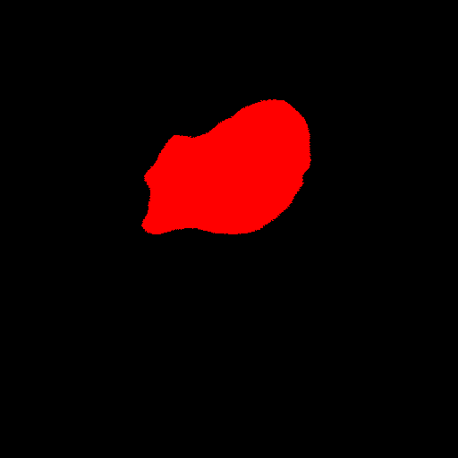</td>
</tr>
</table>

 
<h3>1. Dataset Citation</h3>
The dataset used here has been taken from <b>The Cancer Imaging Archive</b>
 
 
<a href="https://www.cancerimagingarchive.net/collection/breast-lesions-usg/">
<b>
Breast-Lesions-USG | A Curated Benchmark Dataset for Ultrasound Based Breast Lesion Analysis
</b>
</a>
  
<b>Summary</b> 

This dataset consists of 256 breast ultrasound scans collected from 256 patients and 266 benign and malignant segmented lesions.  
It includes patient-level labels, image-level annotations, and tumor-level labels with all cases confirmed by follow-up care 
or biopsy result. Each scan was manually annotated and labeled by a radiologist experienced in breast ultrasound examination. 
In particular, each tumor was identified in the image via a freehand annotation and labeled according to BIRADS features. 
The tumor histopathological classification is stated for patients who underwent a biopsy. 
Patient-level labels include clinical data such as age, breast tissue composition, signs and symptoms. 
 
Image-level freehand annotations identify the tumor and other abnormal areas in the image.  
The tumor and image are labeled with BIRADS category, 7 BIRADS descriptors, and interpretation of critical 
findings as presence of breast diseases.  
Additional labels include the method of verification, tumor classification and histopathological diagnosis.
 
Since the role of machine learning and theoretical computing towards the development of augmented inference 
in the field of cancer detection is indisputable, the quality of the data used to develop any explainable 
augmented inference methods is extremely important. This dataset can be used as an external testing set 
for assessing a model’s performance and for developing explainable AI or supervised machine learning
 models for the detection, segmentation and classification of breast abnormalities in ultrasound images.
  
A detailed description of this dataset can be found here and should be cited along with the citation of the data:
 
Pawłowska, A., Ćwierz-Pieńkowska, A., Domalik, A., Jaguś, D., Kasprzak, P., Matkowski, R., Fura, Ł., Nowicki, A.,
 & Zolek, N. 
  A Curated benchmark dataset for ultrasound based breast lesion analysis. Sci Data 11, 148 (2024). 
   https://doi.org/10.1038/s41597-024-02984-z.
 
 
<b>Citations & Data Usage Policy</b> 
 Data Citation Required: Users must abide by the TCIA Data Usage Policy and Restrictions. 
  Attribution must include the following citation, including the Digital Object Identifier:
  
<b>Data Citation</b> 
Pawłowska, A., Ćwierz-Pieńkowska, A., Domalik, A., Jaguś, D., Kasprzak, P., Matkowski, R., Fura, Ł., 
 Nowicki, A., & Zolek, N. (2024).  
 A Curated Benchmark Dataset for Ultrasound Based Breast Lesion Analysis (Breast-Lesions-USG) (Version 1)  
 [dataset]. The Cancer Imaging Archive. https://doi.org/10.7937/9WKK-Q141
 
 
<h3>
<a id="2">
2 Augmented-Breast-Lesions-USG ImageMask Dataset
</a>
</h3>
 If you would like to train this Breast-Lesions-USG Segmentation model by yourself,
 please download the dataset from the google drive 
<a href="https://drive.google.com/file/d/1Lz_95ooDFiIkXHSO7s3CdeSnt8y7LgGI/view?usp=sharing">
Augmented-Breast-Lesions-USG-ImageMask-Dataset.zip</a>.
 
, expand the downloaded ImageMaskDataset and put it under <b>./dataset</b> folder to be
<pre>
./dataset
└─Breast-Lesions-USG
    ├─test
    │   ├─images
    │   └─masks
    ├─train
    │   ├─images
    │   └─masks
    └─valid
        ├─images
        └─masks
</pre>
 
<b>Breast-Lesions-USG Statistics</b> 
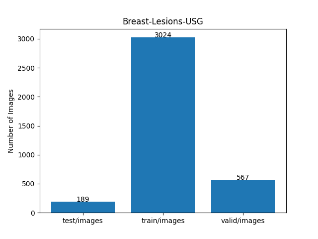 
 
<!--
On the derivation of the 512x512 pixels augmented dataset, please refer to the following Python scripts: 
<li><a href="./generator/ImageMaskDatasetGenerator.py">ImageMaskDatasetGenerator.py</a></li>
<li><a href="./generator/split_master.py">split_master.py</a></li>,
and a tumor classification file. 
<li><a href="./generator/BrEaST-Lesions-USG-clinical-data-Dec-15-2023-Classification.csv">
BrEaST-Lesions-USG-clinical-data-Dec-15-2023-Classification.csv</a></li>
,which was derived from the original
<a href="https://www.cancerimagingarchive.net/wp-content/uploads/BrEaST-Lesions-USG-clinical-data-Dec-15-2023.xlsx">
BrEaST-Lesions-USG-clinical-data-Dec-15-2023.xlsx
</a>
 
-->
 

As shown above, the number of images of train and valid datasets is large enough to use for a training set of our segmentation model.
 
 
<b>Train_images_sample</b> 
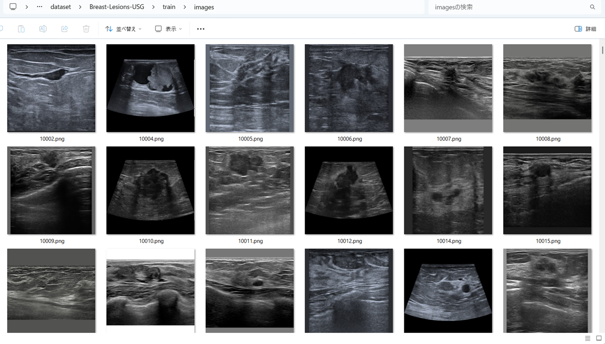
 
<b>Train_masks_sample</b> 
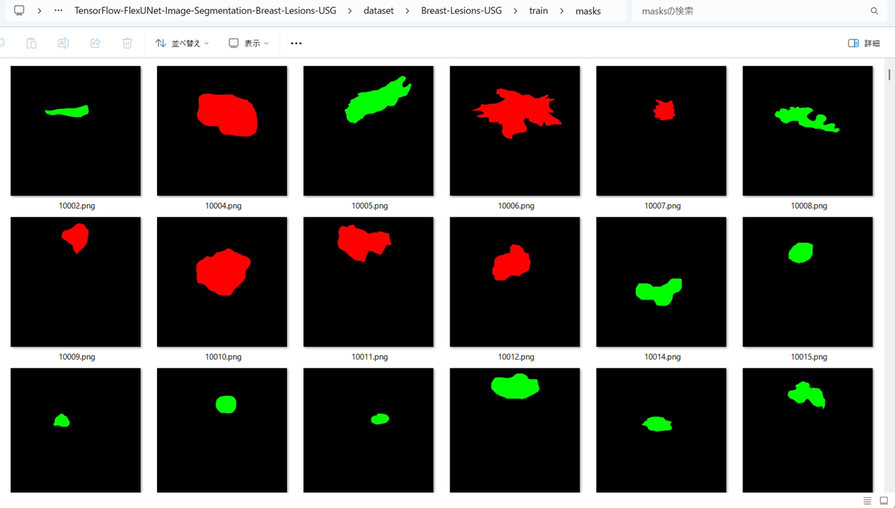
 
<h3>
3 Train TensorFlowFlexUNet Model
</h3>
 We trained Breast-Lesions-USG TensorFlowFlexUNet Model by using the following
<a href="./projects/TensorFlowFlexUNet/Breast-Lesions-USG/train_eval_infer.config"> <b>train_eval_infer.config</b></a> file.  
Please move to ./projects/TensorFlowFlexUNet/Breast-Lesions-USG and run the following bat file. 
<pre>
>1.train.bat
</pre>
, which simply runs the following command. 
<pre>
>python ../../../src/TensorFlowFlexUNetTrainer.py ./train_eval_infer.config
</pre>

<b>Model parameters</b> 
Defined a small <b>base_filters = 16 </b> and large <b>base_kernels = (9,9)</b> for the first Conv Layer of Encoder Block of 
<a href="./src/TensorFlowFlexUNet.py">TensorFlowFlexUNet.py</a> 
and a large num_layers (including a bridge between Encoder and Decoder Blocks).
<pre>
[model]
;You may specify your own UNet class derived from our TensorFlowFlexModel
model         = "TensorFlowFlexUNet"
generator     =  False
image_width    = 512
image_height   = 512
image_channels = 3
num_classes    = 3

base_filters   = 16
base_kernels   = (9,9)
num_layers     = 8
dropout_rate   = 0.05
dilation       = (1,1)
</pre>
<b>Learning rate</b> 
Defined a very small learning rate.  
<pre>
[model]
learning_rate  = 0.00005
</pre>
<b>Loss and metrics functions</b> 
Specified "categorical_crossentropy" and <a href="./src/dice_coef_multiclass.py">"dice_coef_multiclass"</a>. 
<pre>
[model]
loss           = "categorical_crossentropy"
metrics        = ["dice_coef_multiclass"]
</pre>
<b>Dataset class</b> 
Specifed <a href="./src/ImageCategorizedMaskDataset.py">ImageCategorizedMaskDataset</a> class. 
<pre>
[dataset]
class_name    = "ImageCategorizedMaskDataset"
</pre>
 
<b>Learning rate reducer callback</b> 
Enabled learing_rate_reducer callback, and a small reducer_patience.
<pre> 
[train]
learning_rate_reducer = True
reducer_factor     = 0.5
reducer_patience   = 4
</pre>
<b>Early stopping callback</b> 
Enabled early stopping callback with patience parameter.
<pre>
[train]
patience      = 10
</pre>

<b>RGB Color map</b> 
rgb color map dict for Breast-Lesions-USG 1+2 classes. 
<pre>
[mask]
mask_file_format = ".png"

; RGB colors    benign:green, malignanat:red    
rgb_map = {(0,0,0):0,(0,255,0):1,(255,0,0):2,}
</pre>

<b>Epoch change inference callback</b> 
Enabled <a href="./src/EpochChangeInferencer.py">epoch_change_infer callback (EpochChangeInferencer.py)</a></b>. 
<pre>
[train]
epoch_change_infer       = True
epoch_change_infer_dir   =  "./epoch_change_infer"
num_infer_images         = 6
</pre>

By using this callback, on every epoch_change, the inference procedure can be called
 for 6 images in <b>mini_test</b> folder. This will help you confirm how the predicted mask changes 
 at each epoch during your training process.    

<b>Epoch_change_inference output at starting (epoch 1,2,3)</b> 
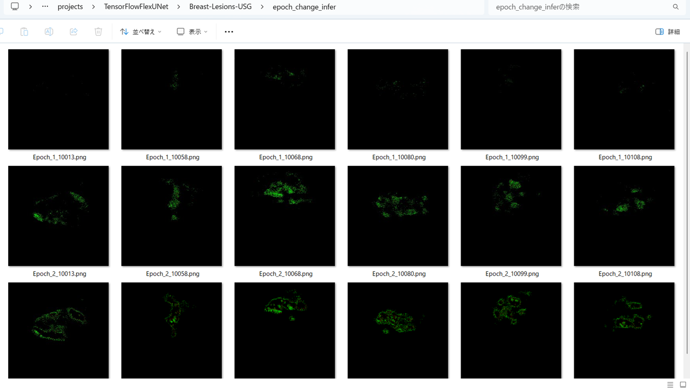 
 
<b>Epoch_change_inference output at middlepoint (epoch 23,24,25)</b> 
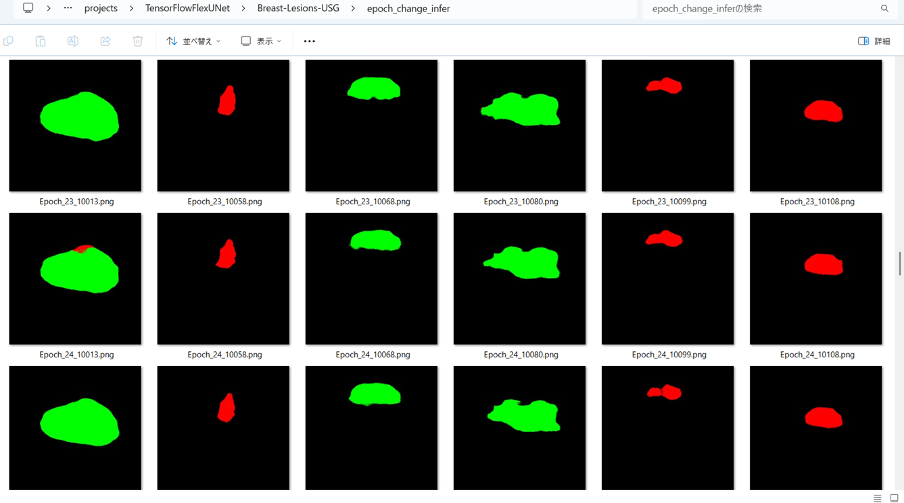 
 
<b>Epoch_change_inference output at ending (epoch 48,49,50)</b> 
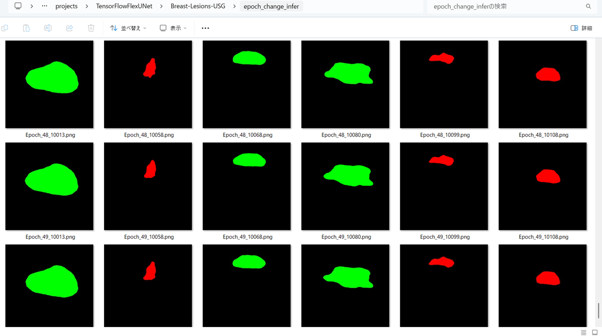 
 
In this experiment, the training process was stopped at epoch 50 by EearlyStopping callback.  
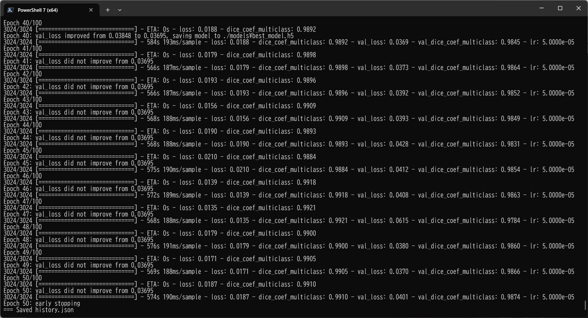 
 

<a href="./projects/TensorFlowFlexUNet/Breast-Lesions-USG/eval/train_metrics.csv">train_metrics.csv</a> 
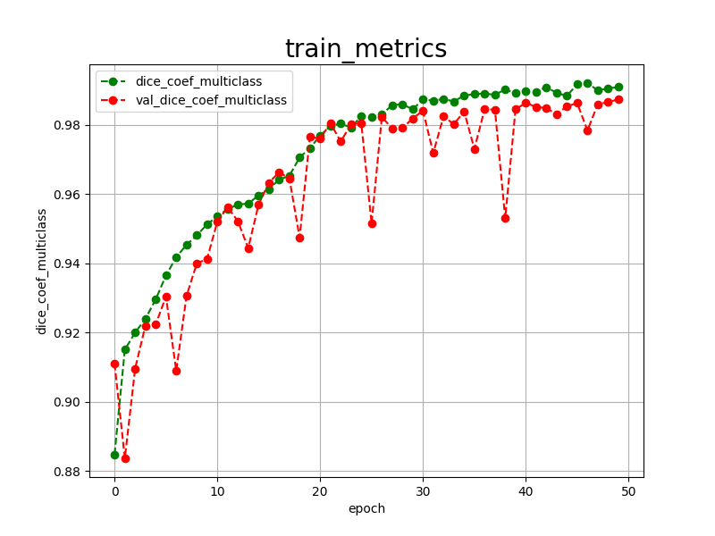 

 
<a href="./projects/TensorFlowFlexUNet/Breast-Lesions-USG/eval/train_losses.csv">train_losses.csv</a> 
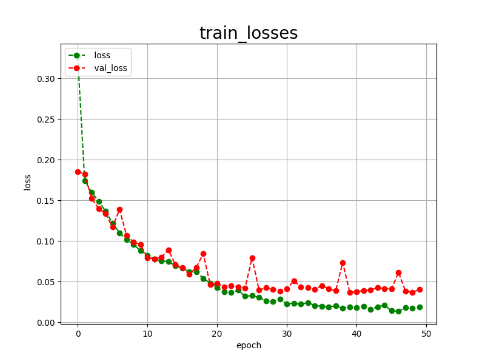 

 

<h3>
4 Evaluation
</h3>
Please move to <b>./projects/TensorFlowFlexUNet/Breast-Lesions-USG</b> folder, 
and run the following bat file to evaluate TensorFlowFlexUNet model for Breast-Lesions-USG. 
<pre>
./2.evaluate.bat
</pre>
This bat file simply runs the following command.
<pre>
python ../../../src/TensorFlowFlexUNetEvaluator.py ./train_eval_infer_aug.config
</pre>

Evaluation console output: 
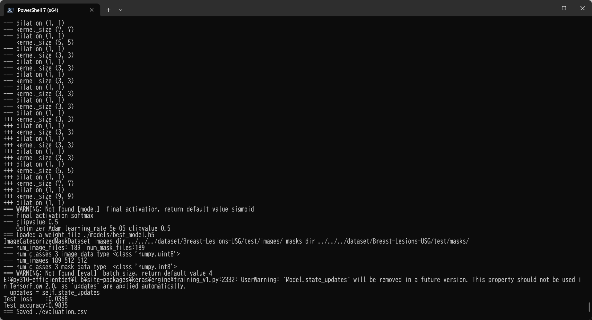
  

<a href="./projects/TensorFlowFlexUNet/Breast-Lesions-USG/evaluation.csv">evaluation.csv</a> 
The loss (categorical_crossentropy) to this Breast-Lesions-USG/test was low and dice_coef_multiclass 
high as shown below.
 
<pre>
categorical_crossentropy,0.0368
dice_coef_multiclass,0.9835
</pre>
 

<h3>
5 Inference
</h3>
Please move <b>./projects/TensorFlowFlexUNet/Breast-Lesions-USG</b> folder 
,and run the following bat file to infer segmentation regions for images by the Trained-TensorFlowFlexUNet model for Breast-Lesions-USG. 
<pre>
./3.infer.bat
</pre>
This simply runs the following command.
<pre>
python ../../../src/TensorFlowFlexUNetInferencer.py ./train_eval_infer_aug.config
</pre>

<b>mini_test_images</b> 
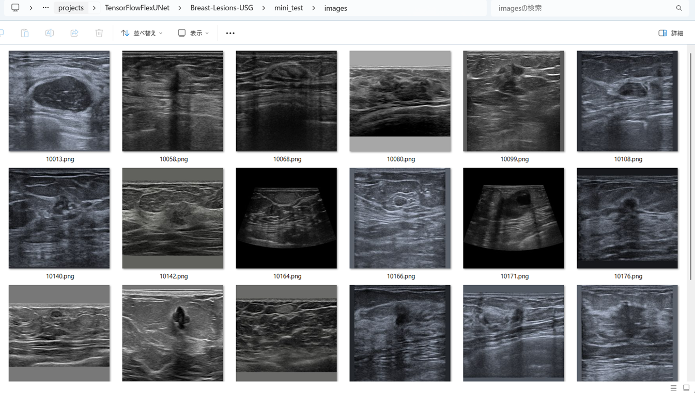 
<b>mini_test_mask(ground_truth)</b> 
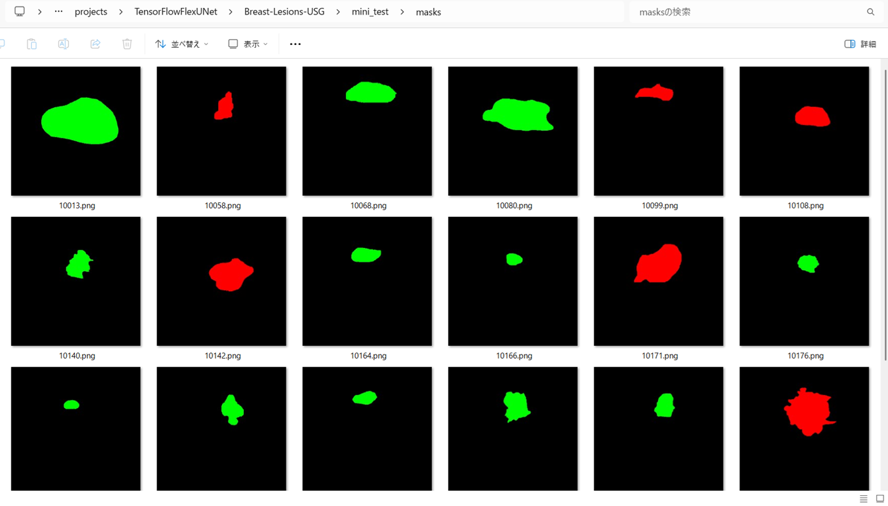 

<b>Inferred test masks</b> 
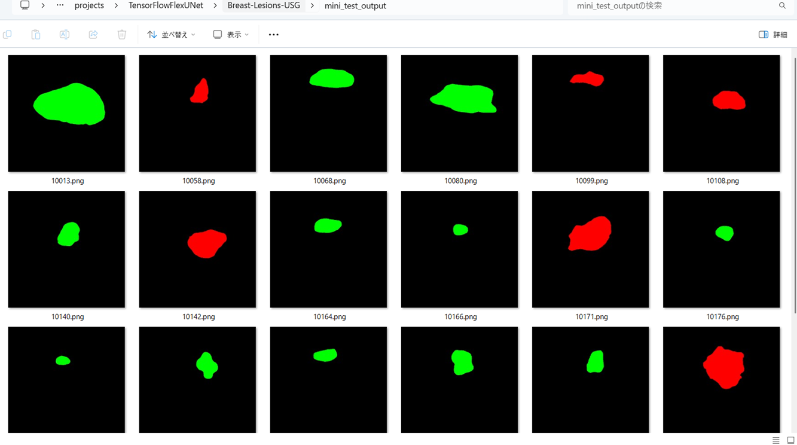 
 

<b>Enlarged images and masks of 512x512 pixels</b> 
<b>rgb_map =  (benign:green, malignant:red)</b> 
<table>
<tr>
<th>Image</th>
<th>Mask (ground_truth)</th>
<th>Inferred-mask</th>
</tr>

<tr>
<td>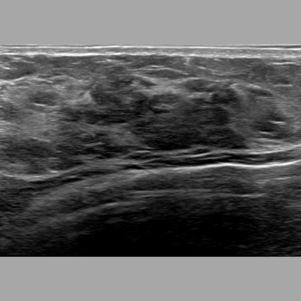</td>
<td>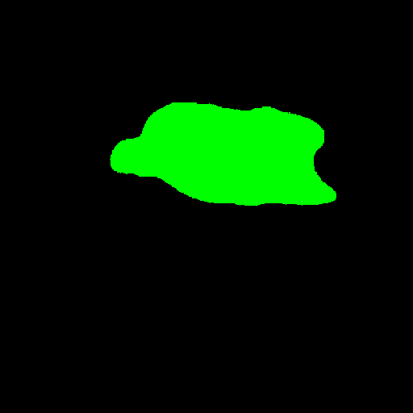</td>
<td>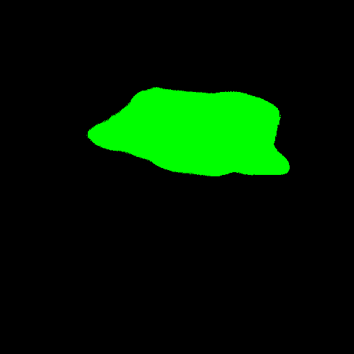</td>
</tr>

<tr>
<td>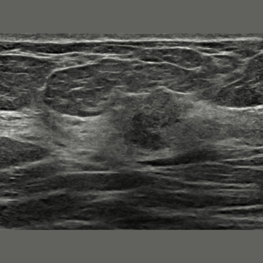</td>
<td></td>
<td></td>
</tr>

<tr>
<td>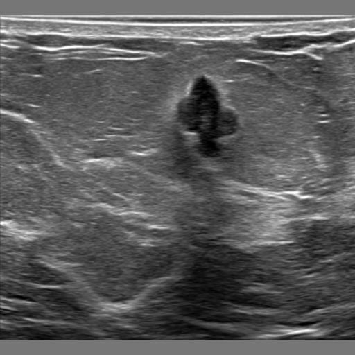</td>
<td>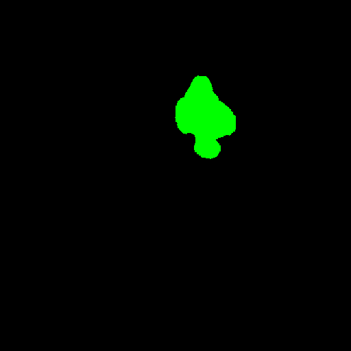</td>
<td></td>
</tr>

<tr>
<td>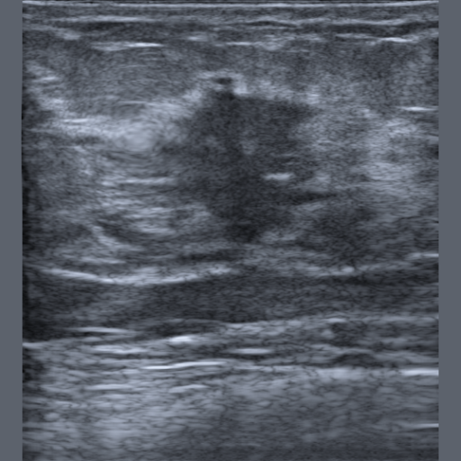</td>
<td>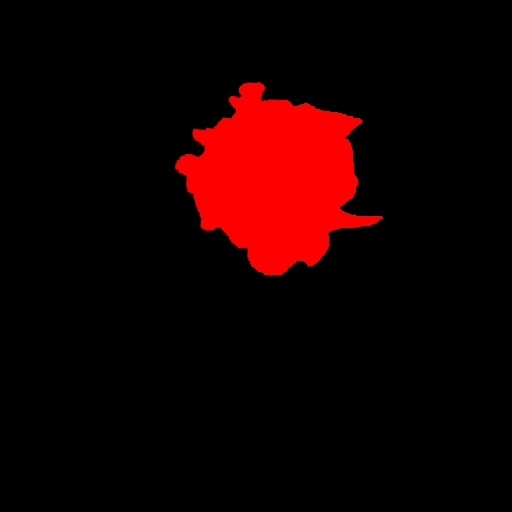</td>
<td></td>
</tr>

<tr>
<td>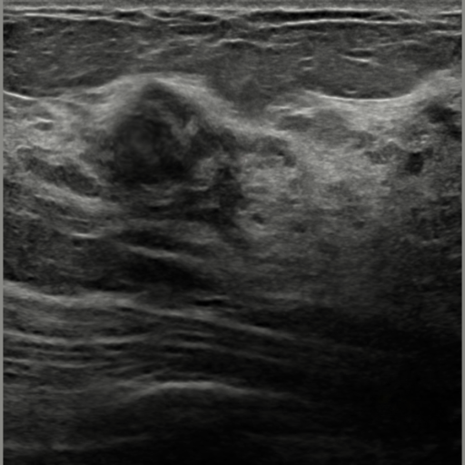</td>
<td>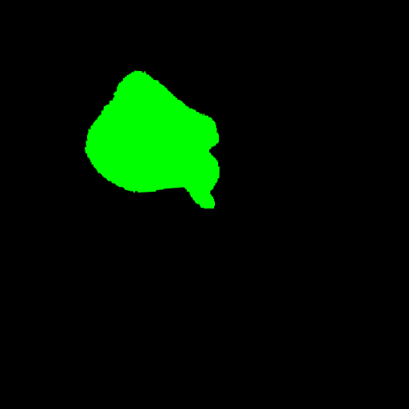</td>
<td>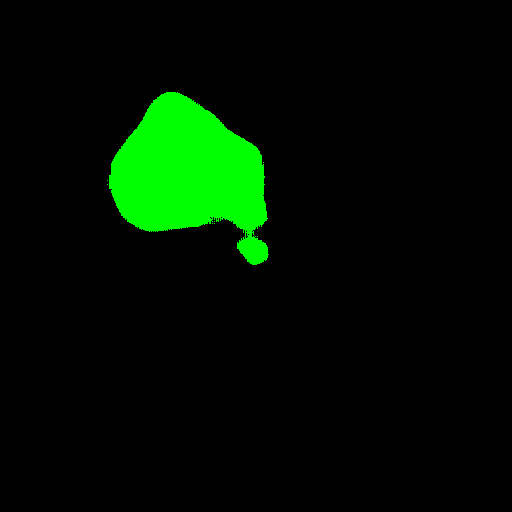</td>
</tr>

<tr>
<td>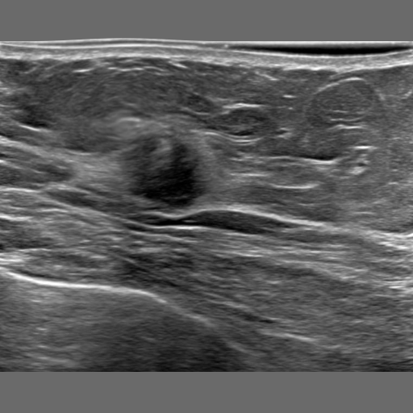</td>
<td></td>
<td></td>
</tr>
</table>

 
<h3>
References
</h3>
<b>1. Breast-Lesions-USG | A Curated Benchmark Dataset for Ultrasound Based Breast Lesion Analysis
</b> 
<a href="https://www.cancerimagingarchive.net/collection/breast-lesions-usg/">
https://www.cancerimagingarchive.net/collection/breast-lesions-usg/</a>

  
<b>2. Curated benchmark dataset for ultrasound based breast lesion analysis</b>
Anna Pawłowska, Anna Ćwierz-Pieńkowska, Agnieszka Domalik, Dominika Jaguś,  
Piotr Kasprzak, Rafał Matkowski, Łukasz Fura, Andrzej Nowicki & Norbert Żołek  
<a href="https://www.nature.com/articles/s41597-024-02984-z">
https://www.nature.com/articles/s41597-024-02984-z
</a>
 
 

<b>3. TensorFlow-FlexUNet-Image-Segmentation-BUS-BRA</b> 
Toshiyuki Arai @antillia.com 
<a href="https://github.com/sarah-antillia/TensorFlow-FlexUNet-Image-Segmentation-BUS-BRA">
https://github.com/sarah-antillia/TensorFlow-FlexUNet-Image-Segmentation-BUS-BRA
</a>
 
 

<b>4. TensorFlow-FlexUNet-Image-Segmentation-BUS-UCLM</b> 
Toshiyuki Arai @antillia.com 
<a href="https://github.com/sarah-antillia/TensorFlow-FlexUNet-Image-Segmentation-BUS-UCLM">
https://github.com/sarah-antillia/TensorFlow-FlexUNet-Image-Segmentation-BUS-UCLM
</a>
 
 

<b>5. TensorFlow-FlexUNet-Image-Segmentation-Breast-Ultrasound-Images</b> 
Toshiyuki Arai @antillia.com 
<a href="https://github.com/sarah-antillia/TensorFlow-FlexUNet-Image-Segmentation-Breast-Ultrasound-Images">
https://github.com/sarah-antillia/TensorFlow-FlexUNet-Image-Segmentation-Breast-Ultrasound-Images
</a>
 
 

